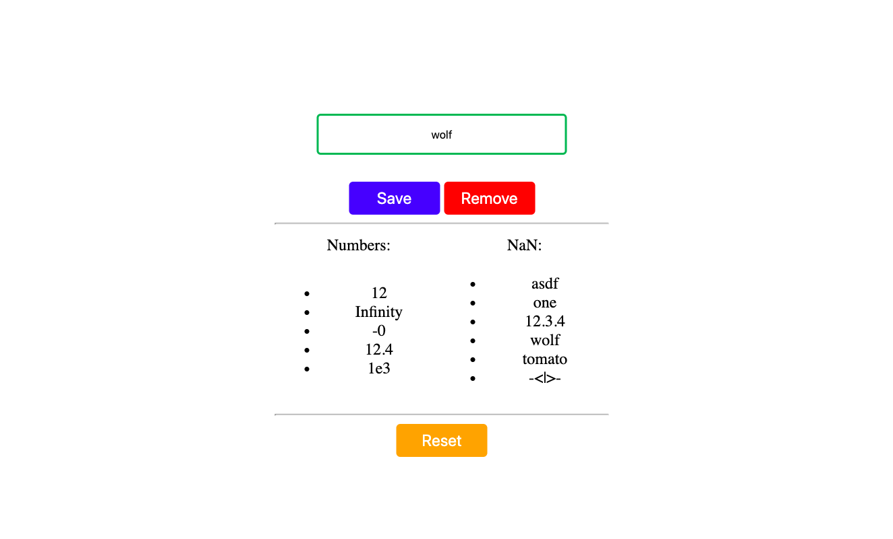

# Numbery & NaNy

> Create a website that sorts user-provided strings into two categories, _NaNy_ and _Numbery_.  It should look like a prettier version of this:

> 

> Further specifications:
> * If a user inputs the same value twice, you should not save it in your app.  Your lists should never have repeated values
> * After a user has removed a value from your state, they should be able to add it again.

> Be sure to organize your code and structure your development strategy!  You can study the [example projects](https://github.com/HackYourFutureBelgium/state/tree/master/example-projects) from this module's repo for an idea of how to do this.

> And don't forget to rewrite this README to describe your project :) Check out these articles to learn more about writing a good README: [makeareadme.com](https://www.makeareadme.com/), [bulldogjob](https://bulldogjob.com/news/449-how-to-write-a-good-readme-for-your-github-project), [meakaakka](https://medium.com/@meakaakka/a-beginners-guide-to-writing-a-kickass-readme-7ac01da88ab3)
